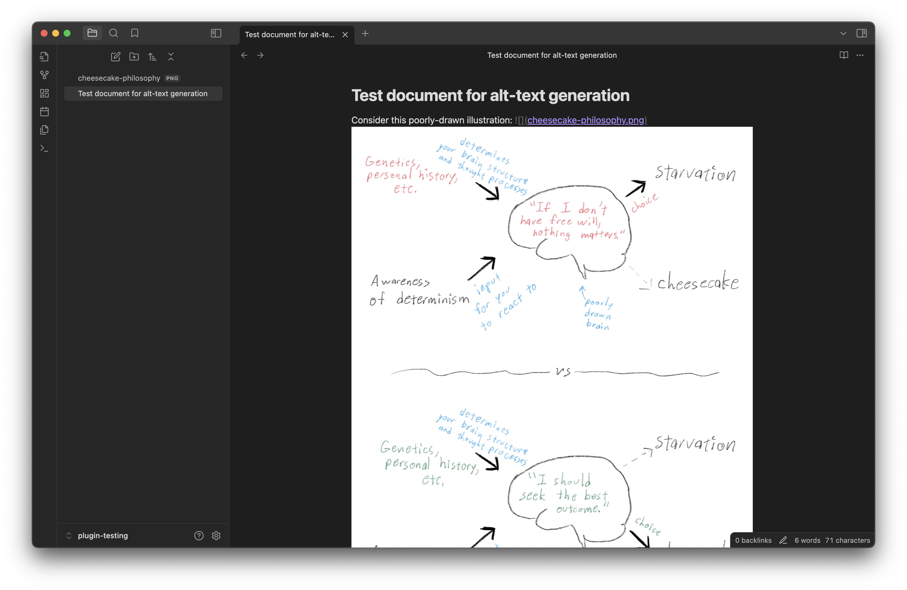
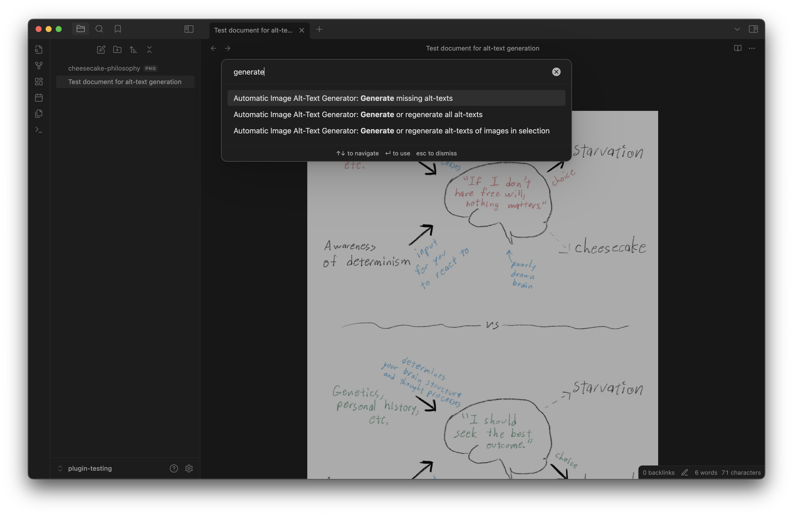
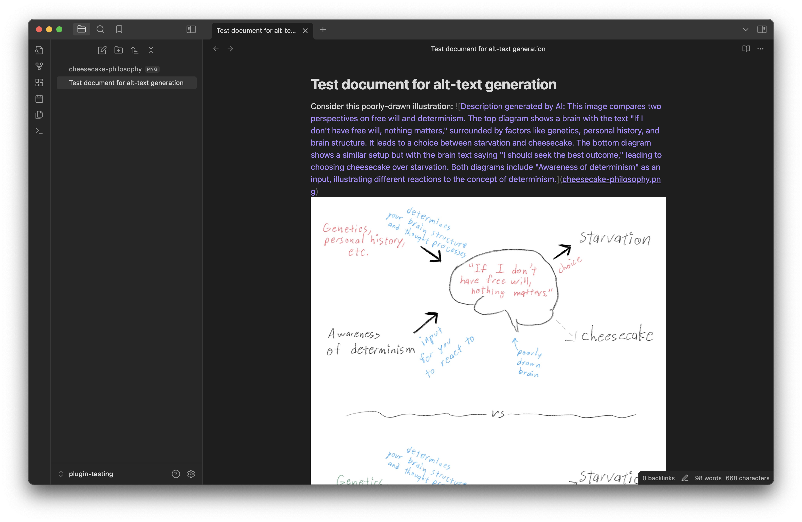

# Auto-Image-Alt: Obsidian plugin using generative AI to add alt-text to images

If you're writing documents that you plan to publish to the web, it's a good practice to include alt-text for images.
But writing descriptions that capture all the important details of an image can be tedious.
AI models can often do a great job!

This plugin uses [Claude](https://claude.ai) to generate alt-text. Example:

# Network Usage

When you run the plugin's commands, images from your document will be sent to Anthropic's API so that it can generate descriptions of them. Don't use the plugin if you aren't comfortable with that!

# Setup

1. Install and enable the plugin
2. Make sure you [have a Claude API key](https://docs.anthropic.com/en/api/getting-started)
3. Paste your API key into the plugin settings. (*Note*: by default, for security reasons, the key is *not* saved to disk, and you will need re-enter it in settings every time you restart the app or reload the plugin. There's an option to persist it which you can enable if you're confident you understand the risks.)

Now you should be ready!

# Commands

- **Generate missing alt-texts**: Finds all the image tags with no alt-text (e.g., tags like ``, where there's nothing in the brackets) and adds alt-text to all of them.
- **Generate or regenerate all alt-texts**: Replaces the alt-text of images that already have alt-text, too.
- **Generate or regenerate alt-texts of images in selection**: Finds the image tag(s) that your cursor is currently inside or that are (at least partially) selected, and replaces their alt-texts.

# Customization

On the settings page, you can change which Claude model is used; what prompt is used; and what boilerplate text (if any) is added to the alt-text along with the generated description.

# Known issues and limitations

- Only supports images stored in your vault, not URLs.
- Assumes references to images are specified using relative paths (e.g., for a file `foo/bar.md` to reference `foo/attachments/image.png`, you must use ``).
- Won't correctly handle image tags that contain brackets inside the alt-text.
- JPEGs don't seem to work and I haven't put much effort into figuring out why (PNGs work).
- If something goes wrong, the error messages tend to be generic and useless (e.g. "Connection error" when it's really not a connection error).
- Generating the description is not instantaneous, and if you edit the document in the intervening period between issuing the command and the command completing, the plugin will probably insert the text into the wrong spot.
- Each image is sent to the AI in isolation, with no context. Perhaps you could get better results by sending part or all of the document too, but I think the results are pretty good as-is.
- Claude has a max file size; the plugin does not check whether the image fits within this and does not attempt to resize it if it doesn't.
- Currently only supports Claude.
